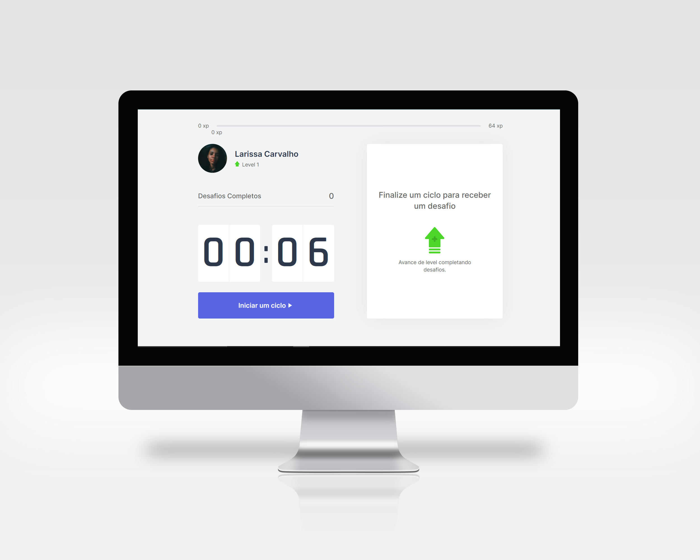

# Move It
> Projeto em Construção 

Você já passou horas trabalhando na frente do computador e no dia seguinte sentiu desconforto na coluna ou dores nas vistas? <br />
O MoveIt veio para solucionar esse impasse. Além de melhorar a sua qualidade de vida ajudará também na sua concentração. <br />
Você será desafiado a fazer um exercício a cada ciclo finalizado e após concluir o desafio você ganhará uma pontuação em XP, mas caso falhe você não ganhará nada a não ser dores nas costas.





## :rocket: Tecnologias Usada:
- HTML5
- CSS3
- ReactJs
- Next.Js
- TypeScript
<br />

## 💼 Ferramentas de Desenvolvimento:
- Visual Studio Code
- Git Bash
<br />


## :computer: Como executar o projeto:

```sh

#Instale o Yarn caso não tenha 
npm install -g yarn

#Clone o repositório
git clone https://github.com/LarissaCalmeida/Move-It

#Entre na pasta clonada:
cd Move-It

#Instale as dependências
npm install

#Execute o Projeto
yarn dev

#Acesse http://localhost:3000 em seu navegador
```
<br />


## Meta

Larissa Carvalho - larissa_carvalho_almeida@hotmail.com
<p align="left">
  <a href="https://www.linkedin.com/in/larissa-carvalho-7149101b8/" alt="Linkedin">
  </a>

  <a href="https://www.instagram.com/lari_carvalho07/?hl=pt-br" alt="Instagram">
  </a>
</p>  


